<div align="center">

[](https://github.com/tttan308)









</div>

```text
┌──[ tan@hcmc ]──[ ~/about ]
└─$ cat profile.json
{
  "name":     "Tran Thai Tan",
  "location": "Ho Chi Minh City, Vietnam",
  "school":   "University of Science - VNUHCM",
  "since":    2021,
  "repos":    { "total": 60, "public": 26, "private": 34 },
  "now":      "MCP server for Mac control, Claude tooling, helpdesk AI agents"
}
```

<div align="center">


</div>
